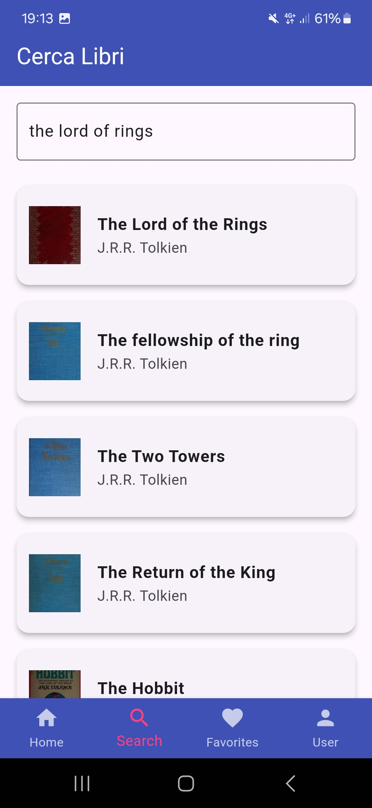
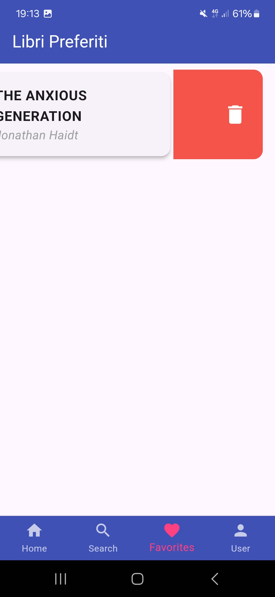

### Nome: Leonardo Bigelli 
### Matricola: 329188
# libreria

  

Progetto sviluppato in Flutter che permette la gestione di una libreria personale.

## Scopo dell'applicazione

L'applicazione permette di gestire una raccolta di libri personale. L'insieme dei libri mostrati nell'applicazione, sono il risultato di una chiamata HTTP a due servizi distinti, OpenLibrary e New York Times. In essa è possibile visualizzare i libri di cui sono state vendute più copie e cercare un libro dato il titolo. In più è presente la possibilità di salvare un libro nei preferiti e poi di rimuoverlo da questa lista, se necessario. 

## Casi d'uso

L'applicazione gestisce un utente, precedentemente creato, a cui sono chieste le credenziali d'accesso per permettere di usufruire dell'applicazione. Una volta effettuato l'accesso, la pagina visualizzata è la Home Page, in cui vengono mostrati i libri con il numero maggiore di copie vendute e anche i libri più in voga del momento. In basso è presente una barra di navigazione in cui è possibile scegliere la pagina in cui accedere. La seconda pagina ha disposizione permette di cercare un libro dato il titolo. Su ciascun libro è possibile visualizzare più dettegli e anche salvarlo nei preferiti, cliccandoci sopra. La lista dei libri salvati nei preferiti è visualizzata nella terza pagina, in cui è possibile rimuovere un libro, precedentemente salvato, effettuando uno "swipe" verso sinistra. L'ultima pagina mostra il profilo dell'utente, indicando username, password e il numero di libri preferiti.

## Esperienza utente 
La prima pagina visualizzata permette l'inserimento delle credenziali d'accesso:

  

Una volta effettuato l'accesso, viene visualizzata la home page. Essa permetterà di conoscere ed esplorare i libri più venduti e quelli più in voga in quel momento:

  

Per la ricerca dei libri, in alto è presente un campo in cui è possibile cercare un nuovo libro, dato il suo titolo. Nell'esempio sotto riportato segue la ricerca "The lord of rings".

  

La terza pagina permette la visualizzazione e l'eleventuale rimozione dei libri salvati nei preferiti. L'azione di eliminare un preferito viene svolta trascinando il libro in questione verso sinistra.

  
  

L'ultima pagina permette di controllare le informazioni dell'utente con l'aggiunta di un contatore dei libri attualmente salvati nei preferiti:

  

## Tecnologia

All'interno dell'applicazione sono stati utilizzati diversi pacchetti, fruti attraverso "pub.dev", per garantire una corretta esecuzione dell'applicativo, rimanendo il linea con la specifica. Segue una lista con breve descrizione dei pacchetti utilizzati.

1. **flutter_riverpod:** pacchetto utilizzato per gestire e propagare lo stato, ovvero l'utenza dove al suo interno è presente la lista di libri salvati nei preferiti;
2. **path_provider:** pacchetto utilizzato per accedere alla path locale dove è installata l'applicazione. Fondamentale in quanto lo stato è salvato localmente nel dispositivo per poter poi essere ricaricato all'apertura dell'applicazione;
3. **flutter_launcher_icons:** pacchetto impiegato per cambiare l'icona dell'applicazione;
4. **http:** pacchetto per poter effettuare e gestire richieste di tipo HTTP.